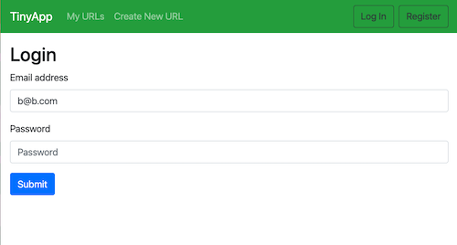
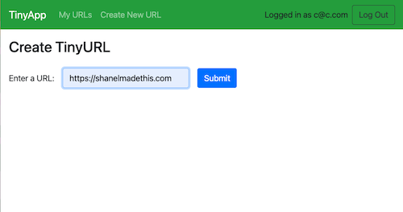
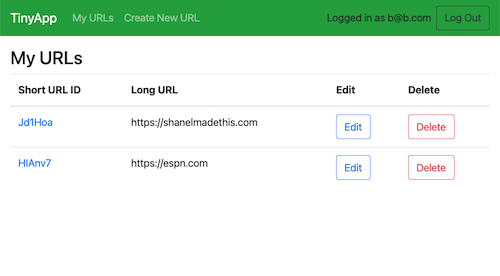
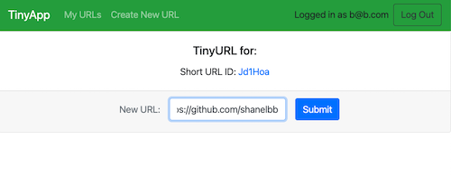

# TinyApp Project

TinyApp is a full stack web application built with Node and Express that allows users to shorten long URLs (à la bit.ly).

## Final Product Screenshots

#### TinyApp login page

#### TinyApp create url page

#### TinyApp My URLs page

#### TinyApp edit url page

## Dependencies

- Node.js
- Express
- EJS
- bcryptjs
- cookie-session

## Dev Dependencies

- chai
- chai-http
- mocha
- nodemon

## Getting Started

- Install all dependencies (using the `npm install` command).
- Run the development web server using the `node express_server.js` command.
